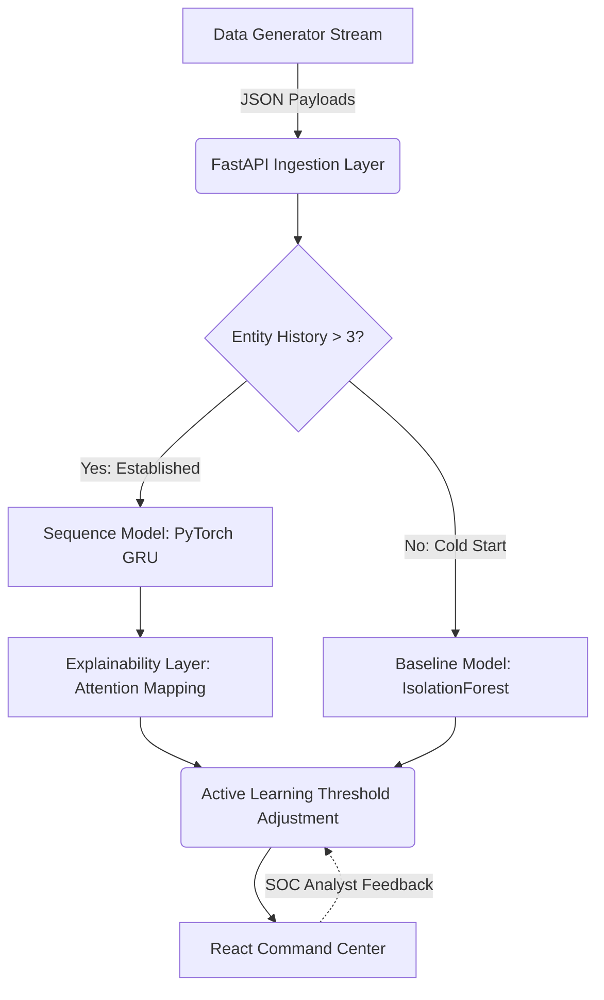

# AI-Powered Behavioral Anomaly Detection for Cybersecurity 🛡️


This repository contains a complete, production-grade prototype for detecting behavioral anomalies in access logs. It models "normal" access/connection behavior for users, service accounts, and devices, and detects intrusions or compromised-credential activity in near real-time from sequential access-log data.

## ✨ Features

- **Synthetic Data Generator**: Simulates realistic user access logs, including 8 distinct behavior patterns with a realistic anomaly rate (~2%).
- **Baseline Profiling Model**: Utilizes an `IsolationForest` to establish per-entity statistical profiles, explicitly handling the "cold-start" problem for new users.
- **Sequence Detection Model**: A sequence-aware PyTorch **GRU (Gated Recurrent Unit)** that flags chronological deviations in user access patterns.
- **Anomaly Classification**: Multi-class classification head attached to the GRU, categorizing attacks into precise taxonomy (e.g., *brute_force, impossible_travel, credential_stuffing*).
- **Explainability Layer**: Extracts attention weights from the GRU to generate human-readable alerts (e.g., *"flagged due to geo-velocity + new device fingerprint"*).
- **Analyst-Facing Dashboard**: A premium, React-based Command Center featuring a ranked live alert queue, dynamic threat analytics, and an Entity History View.

## 🏗️ System Architecture



## 🚀 Getting Started

The demo runs entirely locally, simulating a real-time event stream with a React dashboard and a FastAPI backend.

### Prerequisites
- **Python 3.10+**
- **Node.js 18+** (for the React Frontend)

### 1. Install Python Dependencies
Open your terminal in the root directory and install the required Python packages:

```bash
cd behavioral-anomaly-detector
pip install -r requirements.txt
```

### 2. Install Frontend Dependencies
Navigate to the frontend directory and install the npm packages:

```bash
cd behavioral-anomaly-detector/frontend
npm install
cd ../..
```

### 3. Launching the Platform
Start the backend API and the React frontend simultaneously using the demo script:

```bash
cd behavioral-anomaly-detector
python run_demo.py
```

The script automatically launches:
- **FastAPI Backend**: Bound to `http://localhost:8000`
- **React Dashboard**: Opens at `http://localhost:5173` (Vite's default port, or whichever it assigns).

## ⚔️ Injecting Attacks

Once the dashboard is live:
1. Navigate to the **Attack Injection / Control Panel** in the UI.
2. Select an attack pattern (e.g., `impossible_travel`).
3. Click **Inject Attack**. 
4. Within seconds, the anomaly will be caught by the sequence model and appear in the **Live Alert Queue** with a natural-language explanation.

## 🧠 Advanced Training Workflow

To fine-tune the model further, you can generate larger datasets and train locally.

```bash
cd behavioral-anomaly-detector

# 1. Generate 30,000 events (30 simulated days)
python data/generator.py --days 30

# 2. Train the GRU sequence model (5 epochs)
python models/train.py
```
*Note: The FastAPI server will automatically reload the newly trained weights `model_final.pt` on its next startup.*

## 📦 Packaging

To package the repository for deployment or submission:
```bash
cd behavioral-anomaly-detector
python package.py
```
This produces a `submission.zip` containing the necessary files.
