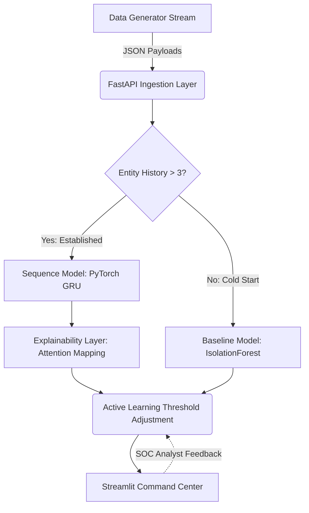

# AI-Powered Behavioral Anomaly Detection for Cybersecurity

This repository contains a complete, production-grade prototype for detecting behavioral anomalies in access logs, built for the Honeywell Hackathon. It models "normal" access/connection behavior for users, service accounts, and devices, and detects intrusions or compromised-credential activity in near real-time from sequential access-log data.

## 🏆 Hackathon Deliverable Mapping

This project explicitly satisfies all 7 required deliverables:

1. **✅ Synthetic Data Generator** (`data/generator.py`): Generates synthetic access logs simulating 8 distinct behavior patterns with documented assumptions (extreme class imbalance at ~2% anomaly rate).
2. **✅ Baseline Profiling Model** (`models/baseline.py`): Utilizes an `IsolationForest` to establish per-entity statistical profiles, explicitly handling the "cold-start" problem for new users.
3. **✅ Detection Model** (`models/sequence_encoder.py`): A sequence-aware PyTorch **GRU (Gated Recurrent Unit)** that flags chronological deviations in user access patterns.
4. **✅ Anomaly Classification** (`models/classifier.py`): Multi-class classification head attached to the GRU, categorizing attacks into precise taxonomy (e.g., *brute_force, impossible_travel, credential_stuffing*).
5. **✅ Explainability Layer** (`explainability/attribution.py`): Extracts attention weights from the GRU to generate human-readable alerts (e.g., *"flagged due to geo-velocity + new device fingerprint"*).
6. **✅ Analyst-Facing Dashboard** (`dashboard/app.py`): A premium, custom-styled Streamlit Command Center featuring a ranked live alert queue, dynamic threat analytics (Plotly), and an Entity History View.
7. **✅ Final Report** (`REPORT.md`): Detailed documentation of behavioral assumptions, class imbalance metrics (Weighted Cross-Entropy), and known system limitations.

## 🏗️ System Architecture



## 1. Local Setup & Execution

The demo runs entirely locally, simulating a real-time event stream.

### Prerequisites
- Python 3.10+
- `pip install -r requirements.txt`

### Launching the Command Center
1. Open a terminal in the root of the project.
2. Run the all-in-one launcher:
   ```bash
   python run_demo.py
   ```
3. The script automatically launches:
   - **FastAPI Backend**: Bound to `http://localhost:8000`
   - **Data Stream**: Continuously feeds normal events into the API.
   - **Streamlit Dashboard**: Opens securely at `http://localhost:8501`.

### Injecting Attacks
Once the dashboard is live, navigate to the **Control Panel** on the sidebar. Select an attack pattern (e.g., `impossible_travel`) and click **🚀 Inject Attack**. Within seconds, the anomaly will be caught by the sequence model and appear in the Live Alert Queue with a natural-language explanation.

## 2. Advanced Training Workflow

To fine-tune the model further, you can generate larger datasets and train locally.

### Local Training
```bash
# 1. Generate 30,000 events (30 simulated days)
python data/generator.py --days 30

# 2. Train the GRU sequence model (5 epochs)
python models/train.py
```
*Note: The FastAPI server will automatically reload the newly trained weights `model_final.pt` on its next startup.*

## 3. Evaluation & Submission

To package the repository for final submission (excluding large generated data and model weights):
```bash
python package.py
```
This produces `submission.zip`. **Note:** Ensure `REPORT.md` and this `README.md` are included alongside your slide deck.
